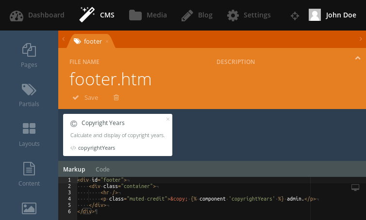
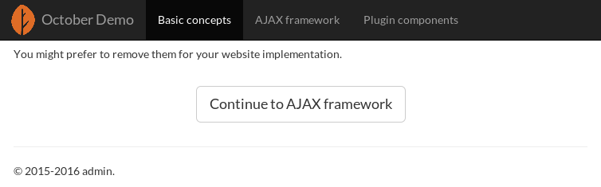

# Copyright Years

A plugin for [October CMS](http://octobercms.com/) that provides the component for calculation and displaying of copyright years.

Copyright years contains years when posts have been published. The component considers only published posts. It finds the minimum and maximum years of a publication.

## Available components

### CopyrightYears

Use the `copyrightYears` component to calculate and display of copyright years.

The `copyrightYears` component injects the following variables to the page where it's used:

* `startYear` &mdash; a minimum year of a publication;
* `endYear` &mdash; a maximum year of a publication.

The next example shows the basic component usage in the footer partial (from the Demo theme):

```html
[copyrightYears]
==
<div id="footer">
    <div class="container">
        <hr />
        <p class="muted credit">&copy;  admin.</p>
    </div>
</div>
```

The default markup (`plugins/thewizardplusplus/copyrightyears/components/copyrightyears/default.htm`) displays the start and end years hyphenated:

```
© 2015-2016 admin.
```

If the start and end years are equals it displays only one:

```
© 2016 admin.
```

## Available languages

* en &mdash; English;
* ru &mdash; Russian.

## Requirements

* [RainLab Blog](http://octobercms.com/plugin/rainlab-blog) plugin.

## Screenshots

Footer markup:



Footer view:



## License

The MIT License (MIT)

Copyright &copy; 2016 thewizardplusplus <thewizardplusplus@yandex.ru>
